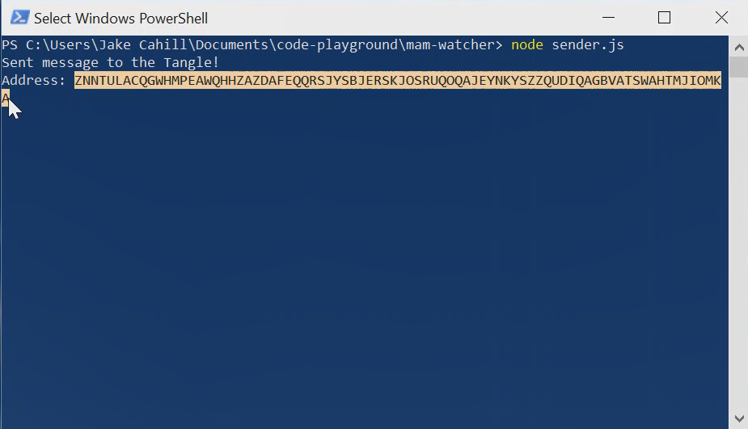
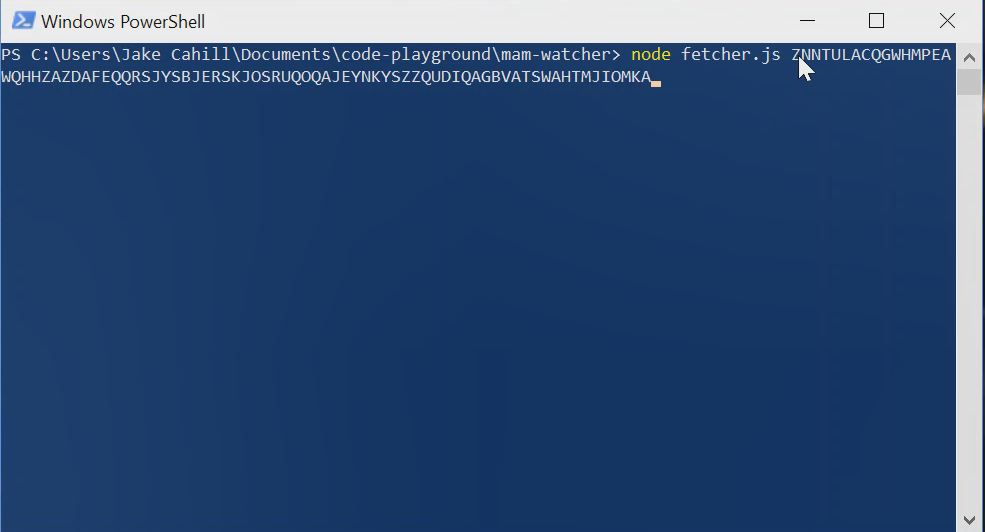

# MAM watcher

This application writes data to a [masked authenticated messaging (MAM)](https://blog.iota.org/introducing-masked-authenticated-messaging-e55c1822d50e) stream and allows you to subscribe to that stream and read the messages.


## Prerequisites

To use this demo, you need the following:

* [An LTS version or the latest version of Node.js and NPM](https://nodejs.org/en/download/)

* [Git](https://git-scm.com/download/linux)

## Run the application

1. Clone this repository

  ```
  git clone https://github.com/iota-community/mam-watcher
  ```
2. Change into the `mam-watcher` directory

  ```bash
  cd mam-watcher
  ```
3. Install the dependencies

  ```bash
  npm install
  ```
4. Start sending messages to a MAM stream

  ```bash
  node sender.js
  ```
  
5. Copy the first address that appears in the console

  

6. Open a new command-prompt window

7. Subscribe to the MAM stream by using the address you just copied

  ```
  node fetcher.js <address (also called the MAM root)>
  ```
  
  

In the console, you should see that the `sender.js` window sends transactions and the `fetcher.js` window subscribes to the channel and retrieves the messages from the Tangle.
